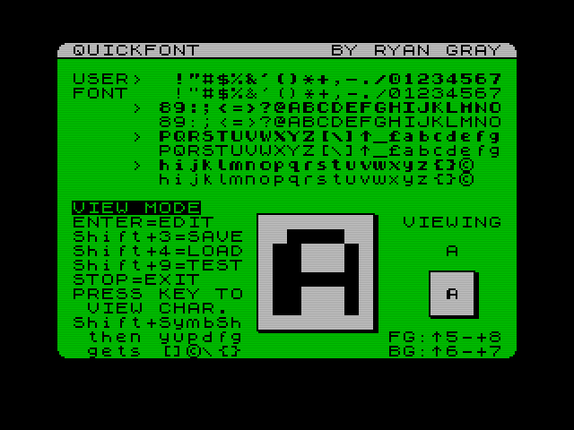
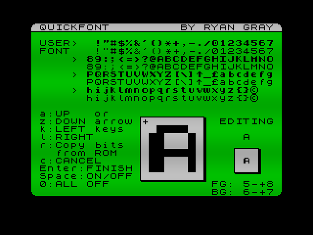
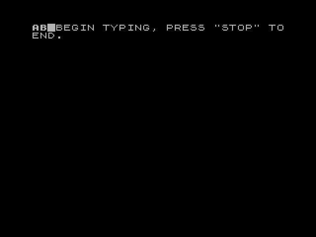

# QuickFont

QuickFont is a user font editor in BASIC for the Timex Sinclair 2068 and 
Sinclair ZX Spectrum.

I originally wrote this on my TS 2068 back in 1985. I typed it into an emulator
from a listing made on the TS 2040 thermal printer that I kept with lots of 
other printouts for many years. I then started to fix a few bugs and make
improvements all these years later.

--- Ryan Gray

## User Fonts

The ZX Spectrum and compatibles had the ability for a user-defined font by
changing the system variable `CHARS` to point to the bytes containing the 
character bit patterns. Normally, this variable points to the character bytes
in the ROM. The characters from space (32) to the copyright symbol (127) are
definable in this group. The block graphics characters are not included (their
codes are above 127). The user-defined graphics (UDG) characters are separately
definable using the methods described in the user manual. 

There are 96 definable characters, each defined by 64 bits contained in 8 
sequential bytes for a total of 768 bytes. The patterns are defined the same as
with UDG characters. There is no reserved memory for a user font as there is 
for the UDGs, so you have to reserve the memory yourself. This program does this
for you by moving the top of the BASIC area down by 768 bytes to place the font 
just below the UDGs in memory. When you are done, you could clear the program 
with NEW and the font will still be there at address 64600.

Once a user font is loaded it is "activated" by pointing `CHARS` to its 
location. You actually point `CHARS` to the location minus 256 bytes, which is
because the ROM saves instructions and time by not subtracting 32 (the code of 
the first definable character) from a character code when computing the byte 
offset in the font for the character. It just multiplies the code by 8 (bytes), 
and since 8*32 = 256, this means the first byte of the first character is at 
offset 256, so they made the font address pointer store the actual address 
less 256 bytes so that adding the offset gets you to the right place. This 
seems odd, but since this opertion is done so frequently in printing, not 
having to subtract 32 each time helped speed things up on old, slow hardware.

Once loaded and activated, your program listing, editing, and printing will
use the font. This includes printing to the thermal printer. Printing to 
regular printers through an interface will not use the font as those work by
sending character codes rather than bit patterns. 

## QuickFont Font Storage

QuickFont reserves some memory immediately below the UDGs by using the `CLEAR` 
statement which moves the top of the BASIC area down as defined in the system 
variable `RAMTOP`. It then lets you edit the characters, storing them in this 
area. It lets you save and load the font to and from tape. You can load a 
font from tape for use, but you need to reserve memory for it as well as 
point `CHARS` to it. There is the sample font loader program in 
`FontLoader.tap` to show you how to do it. You can load the font into a 
different location if you wish by giving the `LOAD ""CODE` command the desired
address. Since the font is above `RAMTOP`, it will persist even after a `NEW` 
command until you reset the machine or move `RAMTOP` above it.

There are some sample fonts in the `fonts` folder stored in `.tap` files. You 
can use the `FontLoader` program to load them, or load them yourself.

## View Mode

The main screen dispays the current user defined font in 4 rows with the ROM 
font character underneath each for reference. There is the help for the view
mode to the left, a preview of the selected character to the right, and a
magnified view of the selected character in the middle. You can press a key to 
view that character of the font. You then press `Enter` to go into *Edit Mode*
to edit the selected character. 

You can change the background color for the character preview on the right side
by pressing shift 5 and 8 to cycle the background color. This also works when in 
*Edit Mode*, except you don't use shift.

From *View Mode*, you can press `Symbol Shift` and `A` (STOP) to quit the 
program. This will display the `POKE` commands for activating the font. 

### Extended Mode Characters

There are a few characters that are normally entered in *Symbol Shift* mode 
(`E` cursor). You can select them similarly by pressing `Caps shift` and
`Symbol Shift`, after which you hear a beep and can then press the key of the
extended mode letter, except you don't have to hold down `Symbol Shift`. This 
applies to the symbols `[`, `]', `\`, `{`, `}`, and the copyright symbol, each 
under the keys `y`, `u`, `d`, `f`, `g`, and `p`, respectively. This entry system 
also applies to typing in *Test Mode*. Pressing any other key cancels the 
temporary mode. In view mode only, you can actually just press `symbol shift` 
and the letter, except for `p`, to get the character since these keys have 
word tokens for their regular *symbol shift*.

Note that the tilde `~` and vertical bar `|` don't appear on the TS 2068 
keyboard because these were replaced with the keywords `FREE` and `STICK`, and
unfortunately, these characters can't be normally printed even though they
are there in the font. You can select them and edit them on a 2068, but you 
will see `FREE` and `STICK` in displayed except for in the magnified bits
view. Support for these on a ZX Spectrum will be in a future update. See the 
bonus program in tildebar.tap which give you access to these two characters 
by copying their bytes from ROM to the UDGs A and B.

Also, on the TS 2068, the `{` and `}` characters don't appear on the keyboard, 
but as the manual describes, they do exist in extended mode on the `f` and `g` 
keys. This seems to be because `ON ERR` and `SOUND` are keyword mode commands 
and `FREE` and `STICK` are leter mode functions, so the extended shift of `f` 
and `g` in letter mode doesn't make sense to insert a command keyword, so it can
insert the brace characters instead. The letter mode functions are entered in
extended letter mode, so it's not possible to also get the tilde and vertical 
bar characters in the same mode.

The keys in view mode are:

    Key            Function

    Enter          Go into edit mode for the current character
    Shift+3        Save the font to tape
    Shift+4        Load a font from tape
    Shift+5 or 8   Change the preview box background color
    Shift+6 or 7   Change the preview box foreground color
    Shift+9        Enter the test mode to type with the font
    STOP           Quit the program
    Shift+Symbol   Enter a one-keypress extended mode to get the characters
          Shift      [ ] \ { } and copyright by then pressing y u d f g or p
    SymbolShift+   Shortcuts to enter [ ] \ { }
      y u d f g
    SymbolShift+q  Copy the ROM font over the user font (with  confirmation)
    Other keys     Views that character

## Edit Mode

This lets you edit the bits of the current character by pressing the space bar 
and using the keys `a`, `z`, `k`, and `l` to move the cursor left, right, up, 
and down, respectively. When done editing, you press `enter` again to save the
changes. While you are editing, an actual size preview is shown in the box on 
the right of the screen.

The keys in edit mode are:

    Key        Function

    a and z    Move edit cursor up and down
    k and l    Move edit cursor left and right
    Arrow keys Also for edit cursor movement
    space      Toggle bit on/off
    5 and 8    Change preview box background color
    6 and 7    Change preview box foreground color
    0          Clear all bits (with confirmation)
    r          Copy bits from the ROM character with confirmation
    R		   Copy bits from the ROM character without confirmation
    c          Cancel edits and go to view mode
    Enter      Save edits and go to view mode
    
When you save changes to a character, the updated character will then appear in  
the user font shown in the top half of the screen.

## Test Mode

Pressing `shift`+`9` in view mode takes you to test mode which lets you type using 
the user font. It first asks you what paper and ink colors to use. You can then 
type away for multiple lines as well as use the delete key to bacspace. Then 
press `STOP` (`symbol shift` + `a`) to quit and return to the view mode.

You can access the extended mode characters here just like you do in view mode
as described above.

## Loading

Pressing `shift`+`7` in view mode lets you load a font from tape previously saved as 
a code block by this program or manually. It should be a code block of 768 
bytes, but it doesn't have to be from the same address as it will be loaded into 
the address the program is currently using for the user font.

It prompts you for the name of the file on tape, but you can just leave it blank 
and just press enter to load the next code block on the tape. For running in an
emulator, you may need to mount a different tape file. To not load a file, enter
the keyword `STOP` as the name by pressing `Symbol Shift` + `a` then `enter`, and you 
will return to the view mode.

## Saving

Pressing `shift`+`6` in view mode lets you save the current user font to tape. It 
will prompt you for a file name to give it. You can enter nothing to cancel 
saving and return to the view mode. The font will be saved to tape as a code 
block of 768 bytes from the address 64600. This can be loaded later, and the
address it loads to can be changed as with loading any code block by giving the
address with the load command as `LOAD "name"CODE address`. See the sample font
loader program.

## Using the Font

See the included sample font loader program for an example of how to reserve 
memory for the font, load the font, and activate it. You might change the 
location it is stored, in which case, you need to load the code to that location 
as well as set the `CHARS` system variable to point to that location (less 256 
bytes).

The example uses the typical location of 64600:

1. Reserve memory by moving `RAMTOP` to at least one less than the font location:

        CLEAR 64600-1 
    
2. Load the font from tape. Its best to specify the location in case it is not
   what you expect. Specify the length for the same reason.
   
        LOAD ""CODE 64600,768
    
3. Activate the font by setting the `CHARS` system variable. This is a two-byte
   variable since it specifies a memory address, and thus needs two `POKE` 
   commands to set. If done manually, you should do this with a multiple 
   statement line of two `POKE` commands, otherwise, you set one of the bytes, and 
   the font pointer immediately changes, making the next command very hard to 
   enter since you won't be able to read what you are typing.
   
        POKE 23606,88: POKE 23607,251
    
   This causes the `CHARS` system variable to point to store the address 
   `88+256*251`, which is 64344. This is the actual address of the font, 64600, minus 256 bytes as previously explained.
   
After creating a font (and saving it), when you quit the program, you can do 
these POKEs to activate the font still in memory. You can then give the NEW 
command and start programming using your new font. 

You could also do these operations in your own program to have it use your font.
Just be aware that the `CLEAR` command with a memory address also does clear the 
variables like the regular `CLEAR` command, so you will need to do that at the 
beginning of your program before setting variables.

## Revision History

### Version 2.0 - 4 September 1985
This was pretty much as it was in the printed listing with a few flaws and 
probably not the last version I made, but it will be a while before I get to
resurrecting files from my old tapes.

### Version 2.0a - 6 June 2022
I started to make improvements and fix a few issues.
It adds foreground color changing for the preview box and shortcuts for 
selecting most of the extended mode characters. It also adds using the arrow 
keys to move the edit cursor around, mostly since emulators map the arrow keys 
to the Sinclair cursor keys (shifted 5 to 8).

### Version 2.1 - 11 June 2022
I started to change the look a bit more. I don't remember why I used uppercase 
so much; it gave it a ZX81 look. I think I didn't like the lowercase in the 
Sinclair font very much, so was avoiding it whereas everyone else was mad about 
it since it was new and not too many micros at the time had lowercase.

Several small changes, including improvements to the exit screen saying how to 
use the font. I better optimized the edit key loop to make it more responsive.
An improvement in test mode when typing near the end of a line or bottom of the 
screen.

### Version 2.1a - 26 June 2022
Further optimization of the edit key loop to make it much better than the last 
improvement.
